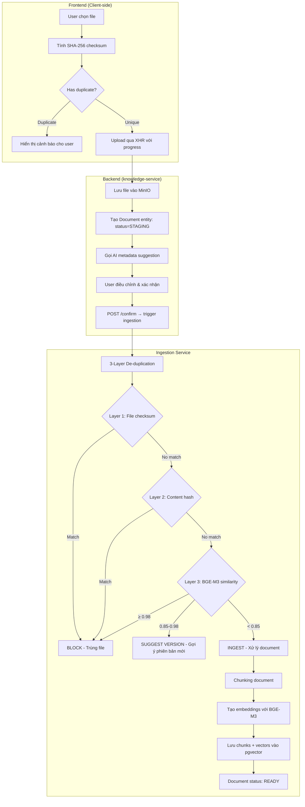
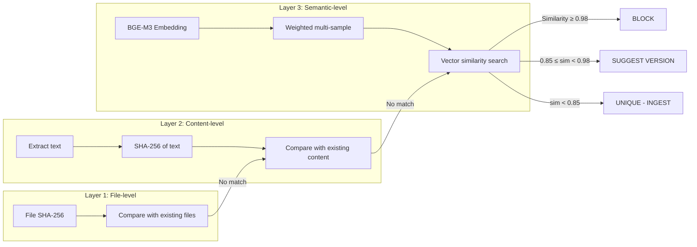
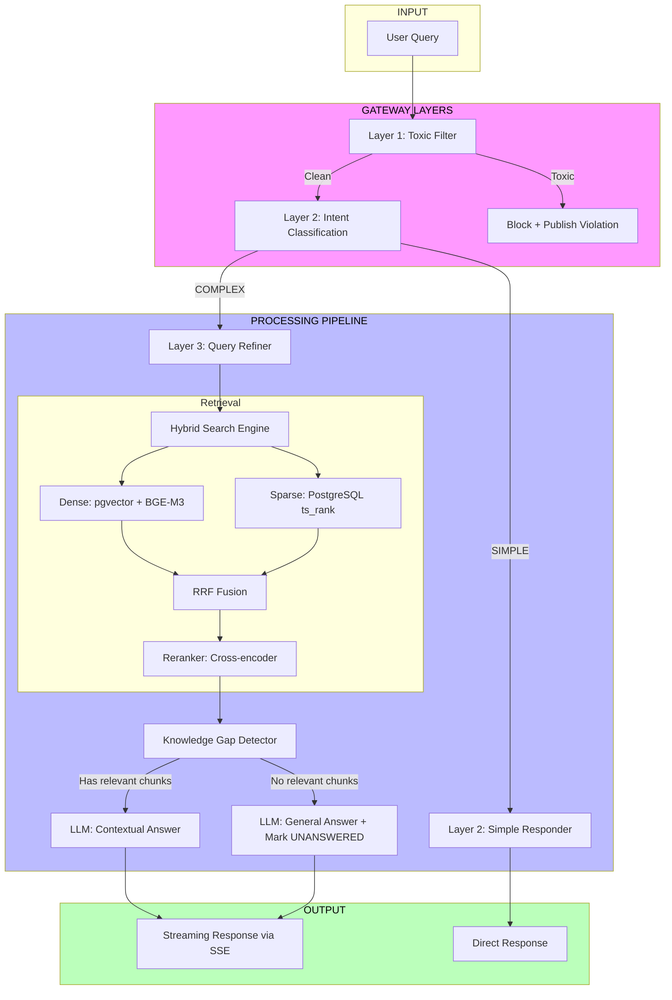
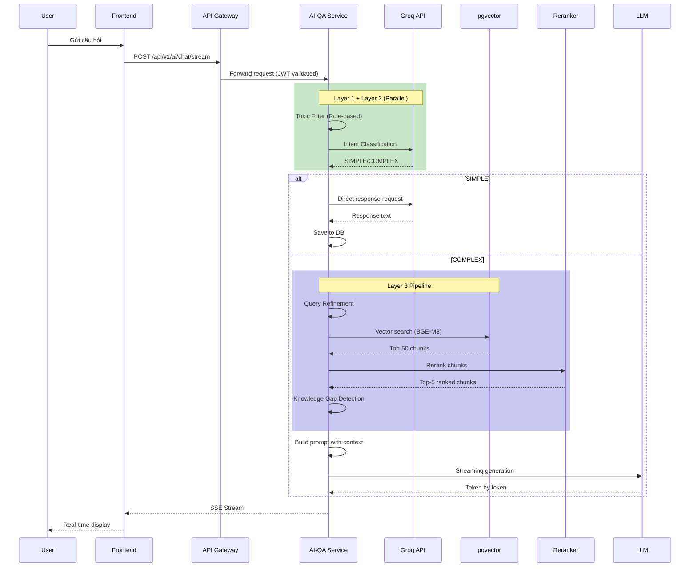
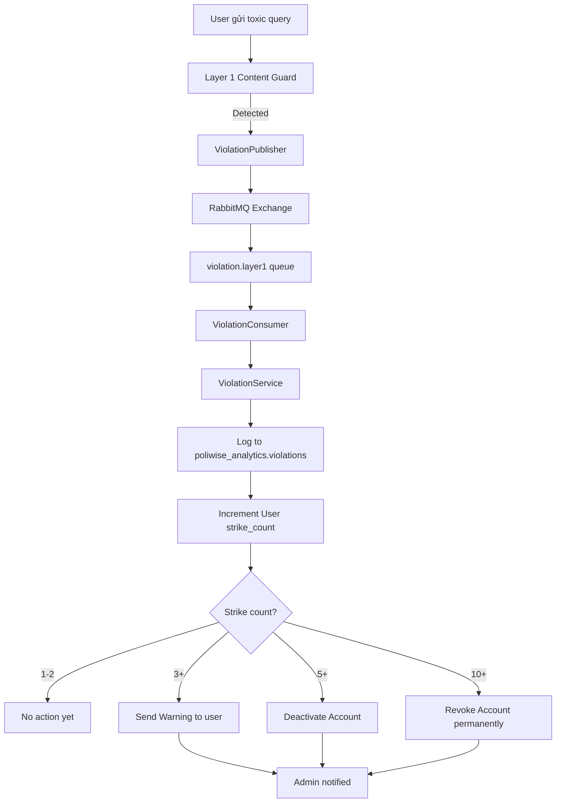
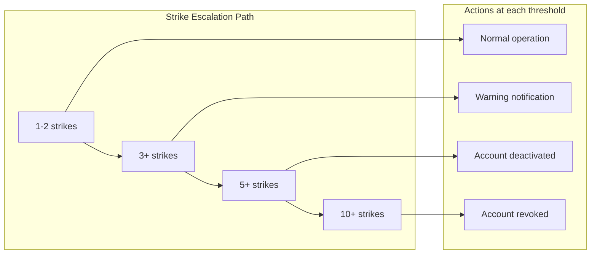
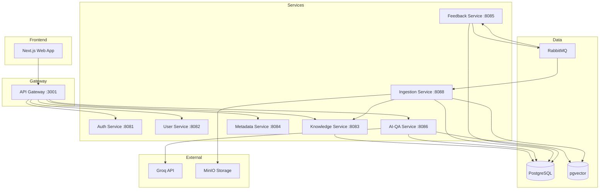

# Poliwise System Flow Documentation

Tài liệu mô tả chi tiết các luồng chính trong hệ thống Poliwise.

---

## 1. Document Upload Flow (Nạp tài liệu)

### 1.1 Tổng quan luồng



### 1.2 Chi tiết từng bước

#### Bước 1: User chọn file

Frontend cung cấp giao diện drag & drop hoặc click để chọn file.

```typescript
// frontend/web/components/documents/UploadModal.tsx
const handleFileSelect = async (files: FileList) => {
  const file = files[0];
  
  // Validate file type
  const allowedTypes = [
    'application/pdf',           // PDF
    'application/vnd.openxmlformats-officedocument.wordprocessingml.document', // DOCX
    'application/vnd.openxmlformats-officedocument.spreadsheetml.sheet', // XLSX
    'text/plain',               // TXT
    'image/png',                // PNG (OCR)
    'image/jpeg',              // JPG (OCR)
    'text/markdown'            // MD
  ];
  
  if (!allowedTypes.includes(file.type)) {
    throw new Error('File type not supported');
  }
  
  // Validate file size (100MB)
  if (file.size > 100 * 1024 * 1024) {
    throw new Error('File size exceeds 100MB limit');
  }
  
  // Proceed to checksum calculation
  const computedChecksum = await computeFileChecksum(file);
};
```

#### Bước 2: Tính SHA-256 checksum (Client-side)

Checksum được tính phía client để:

1. **Pre-check trước khi upload**: Tránh upload file đã tồn tại
2. **De-duplication Layer 1**: So sánh file byte-by-byte
3. **Performance**: Nhanh hơn upload rồi mới check

```typescript
// Utility function to compute SHA-256 checksum
async function computeFileChecksum(file: File): Promise<string> {
  const buffer = await file.arrayBuffer();
  const hashBuffer = await crypto.subtle.digest('SHA-256', buffer);
  const hashArray = Array.from(new Uint8Array(hashBuffer));
  return hashArray.map(b => b.toString(16).padStart(2, '0')).join('');
}
```

#### Bước 3: Pre-check duplicate (Layer 1 only)

```typescript
// frontend/web/services/document.service.ts
const checkDuplicate = async (checksum: string): Promise<DuplicateCheckResult> => {
  const response = await fetch(
    `${API_BASE}/api/v1/documents/check-duplicate?checksum=${checksum}`
  );
  return response.json();
};

// Response structure
interface DuplicateCheckResult {
  isDuplicate: boolean;
  action: 'BLOCK' | 'WARN' | 'ALLOW';
  existingDocument?: {
    id: string;
    title: string;
    uploadedAt: string;
    uploadedBy: string;
  };
  suggestion?: {
    existingVersionId: string;
    similarity: number;
    action: 'NEW_VERSION';
  };
}
```

#### Bước 4-6: Upload và tạo Document

```java
// knowledge-service/DocumentManagementService.java
@Service
public class DocumentManagementService {
    
    @Transactional
    public Document uploadDocument(MultipartFile file, String checksum, 
                                   String uploadedBy, UUID departmentId) {
        // 1. Validate file
        validateFile(file); // 100MB, allowed extensions
        
        // 2. Upload to MinIO (S3-compatible storage)
        String fileKey = minioService.uploadFile(file, checksum);
        
        // 3. Create Document entity with STAGING status
        Document document = Document.builder()
            .title(extractTitleFromFilename(file.getOriginalFilename()))
            .status(DocumentStatus.STAGING)
            .uploadedBy(uploadedBy)
            .departmentId(departmentId)
            .build();
        document = documentRepository.save(document);
        
        // 4. Create Version entity
        DocumentVersion version = DocumentVersion.builder()
            .documentId(document.getId())
            .versionNumber(1)
            .fileKey(fileKey)
            .fileChecksum(checksum)
            .fileSize(file.getSize())
            .mimeType(file.getContentType())
            .originalFilename(file.getOriginalFilename())
            .status(VersionStatus.PENDING)
            .build();
        versionRepository.save(version);
        
        // 5. Publish event to RabbitMQ
        rabbitMQTemplate.convertAndSend(
            "document.uploaded",
            new DocumentUploadedEvent(document.getId(), version.getId())
        );
        
        return document;
    }
    
    @Transactional
    public void confirmDocument(UUID documentId, DocumentConfirmRequest request) {
        // Update document metadata
        document.setTitle(request.getTitle());
        document.setDescription(request.getDescription());
        document.setCategoryId(request.getCategoryId());
        document.setLanguage(request.getLanguage());
        document.setIsPolicy(request.isPolicy());
        document.setStatus(DocumentStatus.CONFIRMED);
        documentRepository.save(document);
        
        // Trigger ingestion pipeline
        ingestionPublisher.publishConfirmEvent(documentId);
    }
}
```

#### Bước 7: Xác nhận metadata (Confirm)

Sau khi upload thành công, AI service gợi ý metadata dựa trên nội dung document:

| Field | Description | AI-generated |
|-------|-------------|--------------|
| `title` | Tiêu đề document | ✅ (extracted from content) |
| `description` | Mô tả ngắn | ✅ (AI-generated summary) |
| `category` | Danh mục | ✅ (based on content classification) |
| `tags` | Tags phân loại | ✅ (keyword extraction) |
| `language` | Ngôn ngữ | ✅ (auto-detected: vi/en) |
| `isPolicy` | Có phải chính sách không | ✅ (policy detection) |

User có thể điều chỉnh trước khi confirm.

---

### 1.3 De-duplication System

#### Tại sao dùng BGE-M3?

**BGE-M3 (BAAI General Embedding M3)** là embedding model state-of-the-art từ BAAI (Beijing Academy of Artificial Intelligence).

**1. Đa ngôn ngữ (Multilingual)**

BGE-M3 được train trên dữ liệu đa ngôn ngữ với hơn 100 ngôn ngữ, bao gồm:

- Tiếng Anh (English)
- Tiếng Việt (Vietnamese) 
- Tiếng Trung (Chinese)
- Tiếng Nhật (Japanese)
- Tiếng Hàn (Korean)
- Tiếng Thái (Thai)
- ... và 95+ ngôn ngữ khác

Với Poliwise - hệ thống quản lý văn bản chính sách tại Việt Nam - việc hỗ trợ tiếng Việt là bắt buộc. BGE-M3 hiểu được:
- Các ký tự có dấu (â, ă, đ, ê, ô, ơ, ư)
- Cấu trúc câu tiếng Việt
- Thuật ngữ chính sách tiếng Việt

**2. Dense + Sparse Embeddings**

BGE-M3 tạo ra 2 loại embeddings:

| Type | Dimension | Use Case |
|------|-----------|----------|
| **Dense** | 1024 chiều | Semantic similarity search |
| **Sparse** | 2501 chiều | Keyword/BM25 matching |

Kết hợp cả 2 cho hybrid search tối ưu.

**3. Performance trên MTEB Benchmark**

MTEB (Massive Text Embedding Benchmark) là benchmark chuẩn cho embedding models:

| Task | BGE-M3 Score | Description |
|------|--------------|-------------|
| Retrieval | **66.4** | Top performer |
| Clustering | **55.4** | Document classification |
| Pair Classification | **84.3** | Semantic similarity |
| Reranking | **60.0** | Cross-encoder tasks |
| STS (Semantic Textual Similarity) | **83.1** | Sentence similarity |

**4. Open Source & Self-hostable**

- **Miễn phí**: Không tốn chi phí API như OpenAI embeddings
- **Self-host**: Có thể deploy trên HuggingFace TEI (Text Embeddings Inference)
- **Privacy**: Dữ liệu không rời khỏi hệ thống
- **Customizable**: Có thể fine-tune nếu cần

**5. Technical Specs**

```python
# Model configuration
BGE_M3_CONFIG = {
    "model_name": "BAAI/bge-m3",
    "max_seq_length": 8192,
    "dense_dimension": 1024,
    "sparse_dimension": 2501,
    "normalize_embeddings": True,
    "batch_size": 32,
}

# Example embedding output
{
    "dense": [0.123, -0.456, ..., 0.789],  # 1024 dims
    "sparse": {
        "indices": [0, 45, 123, ...],      # Word positions
        "values": [0.9, 0.7, 0.5, ...]     # Importance scores
    }
}
```

#### 3-Layer De-duplication

Poliwise sử dụng 3-layer deduplication để đảm bảo:

1. **Không upload trùng lặp**: Tiết kiệm storage
2. **Phát hiện version mới**: Cập nhật document khi có thay đổi
3. **Semantic detection**: Phát hiện document tương tự về nội dung



**Chi tiết từng Layer:**

| Layer | Method | Pros | Cons | Action |
|-------|--------|------|------|--------|
| L1 | File SHA-256 | Instant, exact | Same content diff format = not detected | BLOCK if exact |
| L2 | Content SHA-256 | Format-independent | "Edited" = new hash | BLOCK if exact |
| L3 | BGE-M3 Vector | Semantic similarity | Slower, needs threshold tuning | BLOCK/SUGGEST based on threshold |

#### Layer 1: File-level De-duplication (SHA-256)

**Mục đích**: Phát hiện file trùng lắp byte-by-byte.

**Cách hoạt động**:
1. Frontend tính SHA-256 hash của toàn bộ file
2. Gửi hash lên backend để kiểm tra
3. So sánh với hash của tất cả file đã upload

```typescript
// Frontend: Tính SHA-256 của file
const hash = await crypto.subtle.digest('SHA-256', await file.arrayBuffer());

// Backend: Kiểm tra trùng lắp
const existing = await versionRepo.findByChecksum(hash);
if (existing) return { action: 'BLOCK', existing };
```

**Ưu điểm**: Cực nhanh, chính xác tuyệt đối, không cần giải nén file.
**Nhược điểm**: Chỉ phát hiện file **hoàn toàn giống nhau** (cùng bytes). File cùng nội dung nhưng format khác nhau (PDF vs DOCX) sẽ không bị phát hiện.
**Khi nào trigger**: Mọi file upload đều qua L1 đầu tiên.

#### Layer 2: Content-level De-duplication (Text SHA-256)

**Mục đích**: Phát hiện file trùng lắp **format khác nhau** nhưng nội dung giống nhau.

**Cách hoạt động**:
1. Trích xuất text từ file (bỏ qua định dạng, hình ảnh, font)
2. Tính SHA-256 hash của text thuần túy
3. So sánh với content hash của các document đã lưu

```python
# Backend: Trích xuất text và hash
text = text_extractor.extract(file)  # loại bỏ format, chỉ giữ nội dung
content_hash = hashlib.sha256(text.encode('utf-8')).hexdigest()

existing = await versionRepo.findByContentHash(content_hash)
if (existing) return { action: 'BLOCK', existing }
```

**Ưu điểm**: Format-independent - phát hiện cùng nội dung khác format (PDF→DOCX→TXT).
**Nhược điểm**: Text extraction có thể không hoàn hảo (OCR lỗi, layout phức tạp), và bất kỳ thay đổi nhỏ nào (sửa 1 chữ) đều tạo hash mới.
**Khi nào trigger**: Khi L1 không match (file bytes khác nhau).

#### Layer 3: Semantic De-duplication (BGE-M3 Vector)

**Mục đích**: Phát hiện documents **tương tự về ngữ nghĩa** (dù nội dung không hoàn toàn giống).

**Cách hoạt động**:
1. Lấy 3 samples từ document (head, body, tail) với trọng số khác nhau
2. Generate BGE-M3 embeddings cho từng sample
3. Tính weighted average embedding
4. So sánh vector similarity với tất cả document embeddings trong pgvector

```python
# Multi-sample strategy với weighted average
samples = [
    (head_sample, 0.3),   # 30% - phần mở đầu
    (body_sample, 0.5),   # 50% - phần thân (quan trọng nhất)
    (tail_sample, 0.2),   # 20% - phần kết luận
]

embeddings = await embed_batch([s[0] for s in samples])
weighted_emb = sum(emb * weight for emb, (_, weight) in zip(embeddings, samples))

# So sánh với pgvector
similarity = await find_similar(weighted_emb)
```

**Ưu điểm**: Hiểu ngữ nghĩa - phát hiện documents gần giống, phiên bản cập nhật, nội dung tương tự.
**Nhược điểm**: Chậm hơn L1/L2, cần threshold tuning, có thể false positive.
**Khi nào trigger**: Khi cả L1 và L2 đều không match.

#### Layer 3: Multi-sample Weighted Embedding

Để so sánh semantic giữa 2 documents dài, ta không thể embedding toàn bộ text (giới hạn 512 tokens/chunk). Thay vào đó:

```python
# services/ingestion-service/src/services/deduplicator.py
class Deduplicator:
    SEMANTIC_BLOCK_THRESHOLD = 0.98  # ≥ 98% similar = duplicate
    SEMANTIC_VERSION_THRESHOLD = 0.85  # 85-98% = suggest new version
    
    async def check_semantic_duplicate(self, text: str) -> DeduplicationResult:
        # Sample 1: Introduction (Head)
        # Weight: 0.3 (30%)
        # Rationale: Documents often have similar intro patterns
        head_sample = text[:3000]
        head_weight = 0.3
        
        # Sample 2: Core content (Body)  
        # Weight: 0.5 (50%) - MOST IMPORTANT
        # Rationale: Body contains the unique information
        if len(text) > 4000:
            body_start = (len(text) - 4000) // 2
            body_sample = text[body_start:body_start + 4000]
        else:
            body_sample = text[3000:]
        body_weight = 0.5
        
        # Sample 3: Conclusion (Tail)
        # Weight: 0.2 (20%)
        # Rationale: Similar conclusions don't make documents duplicates
        tail_sample = text[-2000:] if len(text) > 2000 else text[3000:]
        tail_weight = 0.2
        
        # Generate embeddings for all samples
        samples = [(head_sample, head_weight), 
                   (body_sample, body_weight), 
                   (tail_sample, tail_weight)]
        
        embeddings = await embedding_service.embed_batch([s[0] for s in samples])
        
        # Weighted average
        weighted_emb = sum(emb * weight for emb, (_, weight) in zip(embeddings, samples))
        
        # Compare with existing document embeddings in pgvector
        near_duplicates = await version_repo.find_near_duplicates(weighted_emb)
        
        return near_duplicates
```

**Tại sao weighted samples?**

1. **Body weight cao nhất (0.5)**: Phần thân chứa nội dung chính, khác biệt nhất giữa documents
2. **Head weight trung bình (0.3)**: Phần giới thiệu thường có patterns chung
3. **Tail weight thấp nhất (0.2)**: Phần kết luận thường generic

**Threshold explanation:**

| Similarity | Interpretation | Action |
|-----------|----------------|--------|
| ≥ 0.98 | Nearly identical (maybe different formatting) | BLOCK as duplicate |
| 0.85 - 0.98 | Very similar (minor edits) | SUGGEST new version |
| < 0.85 | Different content | ALLOW as new document |

#### Embedding Cache (Layer 3 optimization)

Để tối ưu performance và cost, BGE-M3 embeddings được cache:

```python
# services/ingestion-service/src/services/embedding_service.py
class EmbeddingService:
    async def embed_batch_cached(self, texts: list[str], session) -> list[list[float]]:
        # Step 1: Compute SHA-256 hash for each text
        hashes = [hashlib.sha256(t.encode('utf-8')).hexdigest() for t in texts]
        
        # Step 2: Batch lookup in cache
        cache_hits = await cache_repo.lookup_batch(hashes, EMBEDDING_MODEL_NAME)
        
        # Step 3: Identify cache misses
        miss_indices = [i for i, h in enumerate(hashes) if h not in cache_hits]
        miss_texts = [texts[i] for i in miss_indices]
        
        # Step 4: Generate embeddings only for misses
        if miss_texts:
            miss_embeddings = await self.embed_batch(miss_texts)
            
            # Step 5: Save new embeddings to cache
            await cache_repo.save_batch([{
                "text_hash": hashes[miss_indices[i]],
                "text_length": len(miss_texts[i]),
                "embedding_model": "BGE_M3",
                "embedding_dimension": 1024,
                "embedding_vector": miss_embeddings[i]
            } for i in range(len(miss_texts))])
        
        # Step 6: Merge results (preserving original order)
        return [cache_hits.get(h) or miss_embeddings[miss_indices.index(i)]
                for i, h in enumerate(hashes)]
```

**Cache table schema:**

```sql
CREATE TABLE knowledge.embedding_cache (
    id UUID PRIMARY KEY DEFAULT gen_random_uuid(),
    text_hash VARCHAR(64) NOT NULL UNIQUE,  -- SHA-256 of text
    text_length INTEGER NOT NULL,
    embedding_model VARCHAR(50) NOT NULL,
    embedding_dimension INTEGER NOT NULL,
    embedding_vector VECTOR(1024) NOT NULL,
    created_at TIMESTAMP DEFAULT NOW(),
    updated_at TIMESTAMP DEFAULT NOW()
);

CREATE INDEX idx_embedding_cache_hash ON knowledge.embedding_cache(text_hash);
CREATE INDEX idx_embedding_cache_model ON knowledge.embedding_cache(embedding_model);
```

---

## 2. AI Chat Flow (RAG Pipeline)

### 2.1 Tổng quan RAG Pipeline



### 2.2 Chi tiết từng Layer

#### Layer 1: Toxic Filter (Content Guard)

Content Guard là lớp bảo vệ đầu tiên, ngăn chặn queries độc hại.

**Architecture:**

```python
# services/ai-qa-service/src/services/pipeline/layer1_toxic_filter.py
class ToxicFilterService:
    """
    Layer 1: Multi-stage toxic content detection
    
    Stage 1: Rule-based pre-filter (fast, no API call)
    Stage 2: LLM classification (accurate, async)
    """
    
    TOXIC_PATTERNS = [
        r'\b(hack|exploit|bypass)\b',  # Security-related
        r'<script.*?>.*?</script>',      # XSS injection
        r'\$\(.*\)',                     # Command injection
        # ... more patterns
    ]
    
    CATEGORIES = [
        "TOXIC_QUERY",   # General toxic content
        "ABUSE",         # Personal attacks
        "SPAM",          # Repetitive/nonsensical
        "JAILBREAK",     # Prompt injection attempts
        "INJECTION",     # Code/injection attacks
    ]
    
    async def check(self, query: str) -> ToxicFilterResult:
        # Stage 1: Fast rule-based check
        if self._matches_patterns(query):
            return ToxicFilterResult(
                is_toxic=True,
                label="TOXIC_QUERY",
                severity="LOW"
            )
        
        # Stage 2: LLM classification (if needed)
        llm_result = await self._llm_classify(query)
        if llm_result.is_toxic:
            await self.violation_publisher.publish(llm_result)
            return llm_result
        
        return ToxicFilterResult(is_toxic=False)
```

**Violation event published to RabbitMQ:**

```python
# When toxic content detected
await violation_publisher.publish(
    ViolationEvent(
        type="TOXIC_QUERY",
        severity="HIGH" if label in ["JAILBREAK", "INJECTION"] else "LOW",
        evidence=query,
        user_id=user_context.user_id,
        source="SYSTEM",
        timestamp=datetime.utcnow()
    )
)
```

#### Layer 2: Intent Classification

**Model: Llama-3.1-8B-Instant via Groq API**

**Tại sao Llama-3.1-8B-Instant?**

| Criteria | Llama-3.1-8B-Instant | GPT-4 | Claude |
|----------|---------------------|-------|--------|
| **Speed (Groq)** | ~1000 tokens/sec | ~50 tokens/sec | ~80 tokens/sec |
| **Cost** | $0.05/1M tokens | $15/1M tokens | $3/1M tokens |
| **Vietnamese** | ✅ Good | ✅ Excellent | ✅ Excellent |
| **Simple task** | ✅ Ideal | ❌ Overkill | ❌ Overkill |

**Llama-3.1-8B-Instant advantages:**

1. **Ultra-fast inference**: Groq LPU (Language Processing Unit) đạt ~1000 tokens/sec
2. **Cost-effective**: Rẻ hơn 300x so với GPT-4 cho classification task
3. **Sufficient accuracy**: Với binary classification (SIMPLE vs COMPLEX), 8B model là đủ
4. **Low latency**: User không notice delay khi typing

**Classification prompt:**

```python
# services/ai-qa-service/src/services/pipeline/layer2_intent_classifier.py
INTENT_CLASSIFICATION_PROMPT = """You are an intent classifier for an AI policy assistant.
Your task: Classify the user query as [SIMPLE] or [COMPLEX].

[SIMPLE]: Questions that DO NOT require searching internal documents.
If an ordinary person without special knowledge could answer confidently, it is SIMPLE.

Examples of SIMPLE:
- "Hello, how are you?" -> SIMPLE
- "What is 2 + 2?" -> SIMPLE  
- "Thank you, goodbye!" -> SIMPLE
- "What's the weather today?" -> SIMPLE
- "Can you help me?" -> SIMPLE

[COMPLEX]: Questions that REQUIRE searching internal documents/policies.
If you would need to look up a document/policy to answer correctly, it is COMPLEX.

Examples of COMPLEX:
- "What is our company's remote work policy?" -> COMPLEX
- "How many vacation days am I entitled to?" -> COMPLEX
- "What are the expense reimbursement procedures?" -> COMPLEX
- "policy về remote work như thế nào?" -> COMPLEX (Vietnamese mixed)

Rule: 
- SIMPLE = any person could answer without documents
- COMPLEX = needs internal knowledge/policy lookup

User Query: {query}

Recent conversation:
{recent_history}

Return ONLY one word: [SIMPLE] or [COMPLEX]"""
```

**Intent types explained:**

| Intent | Description | Pipeline Path |
|--------|-------------|----------------|
| **SIMPLE** | Greeting, math, general knowledge | Layer 2 Responder (direct LLM) |
| **COMPLEX** | Policy questions, document-specific | Layer 3 + RAG pipeline |

**SIMPLE query examples:**

```python
SIMPLE_QUERIES = [
    "hello", "hi there", "chào bạn",  # Greetings
    "how are you?", "bạn khỏe không?",  # Check-in
    "2 + 2 = ?", "5 nhân 6 bằng bao nhiêu",  # Math
    "thanks", "cảm ơn", "goodbye", "tạm biệt",  # Closing
    "what is the weather?", "trời hôm nay thế nào",  # General
    "who are you?", "bạn là ai",  # Meta questions
]
```

**COMPLEX query examples:**

```python
COMPLEX_QUERIES = [
    "what is our WFH policy?",  # Policy lookup
    "policy về làm việc từ xa",  # Vietnamese policy
    "how do I request time off?",  # Procedure
    "expense report process",  # Process documentation
    "remote work guidelines",  # Guidelines
    "benefits for new employees",  # HR policy
]
```

#### Layer 3: Query Refinement

Query Refiner contextualizes and improves the search query:

```python
# services/ai-qa-service/src/services/pipeline/query_refiner.py
class QueryRefinerService:
    """
    Refines user query before retrieval:
    1. Contextualize follow-up questions
    2. Translate mixed language queries
    3. Expand abbreviations
    """
    
    async def refine(self, original_query: str, history: list[Message]) -> RefinedQuery:
        # Build context from conversation history
        context = self._build_context(history)
        
        prompt = QUERY_REFINEMENT_PROMPT.format(
            original_query=original_query,
            context=context
        )
        
        refined = await groq_client.complete(prompt)
        
        return RefinedQuery(
            original=original_query,
            refined=refined,
            was_expanded=(refined != original_query)
        )
```

**Examples:**

| Original Query | Refined Query | Reason |
|----------------|---------------|--------|
| "nó có được không?" | "policy này có được phép không?" | Follow-up context |
| "WFH policy" | "remote work policy work from home" | Expand abbreviation |
| "chính sách đó" | "chính sách nghỉ phép năm 2024" | Previous context |

#### Hybrid Search (Retrieval)

Hybrid search kết hợp 2 phương pháp retrieval:

**1. Dense Retrieval (Semantic)**
- Sử dụng BGE-M3 embeddings
- Tìm documents có ngữ nghĩa tương tự query
- Tốt với synonyms, paraphrases

**2. Sparse Retrieval (Full-text Search)**
- Sử dụng PostgreSQL `ts_rank` (BM25-like algorithm)
- Tìm documents chứa keywords chính xác
- Tốt với technical terms, proper nouns

```python
# services/ai-qa-service/src/services/retrieval/hybrid_search.py
class HybridSearchService:
    """
    Hybrid search combining dense + sparse retrieval
    
    Dense: BGE-M3 embeddings → pgvector (cosine similarity)
    Sparse: PostgreSQL ts_rank (BM25-like full-text search)
    """
    
    async def search(
        self,
        query: str,
        user_id: str,
        user_role: str,
        filters: Optional[RetrievalFilters] = None,
        limit: int = 10
    ) -> list[RetrievalChunk]:
        # 1. Generate query embedding with BGE-M3
        query_embedding = await self.embedding_service.embed(query)
        
        # 2. Dense retrieval via pgvector
        dense_chunks = await self.vector_store.search(
            embedding=query_embedding,
            limit=limit * 2,  # Get more for reranking
            filters=self._build_filters(user_id, user_role, filters)
        )
        
        # 3. Sparse retrieval via BM25
        sparse_chunks = await self.bm25_index.search(
            query=query,
            limit=limit * 2
        )
        
        # 4. Reciprocal Rank Fusion (RRF)
        ranked_chunks = self._reciprocal_rank_fusion(
            dense_results=dense_chunks,
            sparse_results=sparse_chunks,
            k=60  # RRF constant
        )
        
        return ranked_chunks[:limit]
    
    def _reciprocal_rank_fusion(
        self,
        dense_results: list[Chunk],
        sparse_results: list[Chunk],
        k: int = 60
    ) -> list[Chunk]:
        """
        Reciprocal Rank Fusion combines rankings from multiple retrievers.
        
        Formula: RRF(d) = Σ 1/(k + rank(d))
        
        Benefits:
        - Simple yet effective
        - No training needed
        - Handles different result sets well
        """
        scores = defaultdict(float)
        
        for rank, chunk in enumerate(dense_results):
            scores[chunk.id] += 1 / (k + rank + 1)
        
        for rank, chunk in enumerate(sparse_results):
            scores[chunk.id] += 1 / (k + rank + 1)
        
        sorted_chunks = sorted(
            dense_results + sparse_results,
            key=lambda c: scores[c.id],
            reverse=True
        )
        
        return sorted_chunks
```

**Reciprocal Rank Fusion (RRF) Score - Ý nghĩa và Ứng dụng:**

RRF score của 1 chunk = **tổng điểm từ cả Dense và Sparse retrieval**, được tính bằng:

```
score = 1/(k + dense_rank) + 1/(k + sparse_rank)
```

**Ví dụ thực tế trong Poliwise:**

Query: "chế độ nghỉ phép năm 2026"

| Chunk | Dense Score | Sparse Score | **RRF Total** |
|-------|------------|--------------|---------------|
| "Quy định nghỉ phép" | 1 | 1 | 0.7/61 + 0.3/61 = **0.0164** |
| "Working from home policy" | 3 | 8 | 0.7/63 + 0.3/68 = **0.0088** |
| "Leave policy 2026" | 2 | 3 | 0.7/62 + 0.3/63 = **0.0115** |

→ **Chunk 1 và 3** được ưu tiên cao nhất vì đứng top trong cả 2 retrievers.

**Tại sao cần kết hợp cả 2?**

| Retriever | Strength | Weakness |
|-----------|----------|----------|
| **Dense** | Hiểu "nghỉ phép" ≈ "time off" | Không bắt được từ hiếm |
| **Sparse** | Exact match từ khóa | Không hiểu synonyms |

**RRF kết hợp cả 2** → đảm bảo:
- Documents có keywords đúng → được boost từ sparse
- Documents có ngữ nghĩa liên quan → được boost từ dense

**Trong Conversation Context:**

Sau khi retrieve, chunks được đưa vào prompt cho LLM:

```
Context chunks:
1. [RRF: 0.0164] Quy định nghỉ phép - công ty ABC...
2. [RRF: 0.0115] Leave policy 2026 - employee handbook...

Question: chế độ nghỉ phép năm 2026?
Answer: Theo quy định của công ty...
```

**pgvector query example:**

```sql
-- Vector similarity search with RBAC filters
SELECT 
    dc.id,
    dc.chunk_text,
    dc.metadata,
    dc.embedding <=> $1 AS distance
FROM knowledge.document_chunks dc
JOIN knowledge.documents d ON dc.document_id = d.id
WHERE 
    -- RBAC: User can only see documents in their department or public
    (d.department_id = $2 OR d.is_public = true)
    -- Status filter: Only READY documents
    AND d.status = 'READY'
    -- Optional category filter
    AND ($3::uuid IS NULL OR d.category_id = $3)
ORDER BY dc.embedding <=> $1
LIMIT 10;
```

#### Reranker

**Model: Cross-encoder**

**Vai trò của Reranker trong Pipeline:**

Reranker là bước **cuối cùng** trước khi đưa context vào LLM. Nó nhận đầu vào là Top-20 chunks từ RRF và trả về Top-5 chunks chất lượng nhất.

```
Query → [Dense Search] → Top-50
      → [Sparse Search] → Top-50  
      → [RRF Fusion] → Top-20  ← Nhanh, recall cao
      → [Cross-encoder Reranker] → Top-5  ← Chính xác, precision cao
      → LLM → Answer
```

**Tại sao cần Reranker?**

Vector search (Dense + Sparse) tốt trong việc **recall** - tìm tất cả documents liên quan. Tuy nhiên, chúng dùng approximate nearest neighbor nên ranking không hoàn hảo.

Reranker dùng **cross-encoder** để:
- Đánh giá chính xác hơn mức độ relevance giữa query và từng document
- Phân biệt được subtle differences (VD: "remote work" vs "remote sensing")
- Đưa ra final ranking chính xác hơn

**Cross-encoder vs Bi-encoder:**

| Aspect | Bi-encoder (Retrieval) | Cross-encoder (Reranking) |
|--------|------------------------|----------------------------|
| **Cách hoạt động** | Query → Vector, Doc → Vector riêng | Query + Doc → Vector CHUNG |
| **Tốc độ** | Nhanh (1 forward pass mỗi cái) | Chậm (N forward passes) |
| **Độ chính xác** | Tốt cho retrieval | Xuất sắc cho ranking |
| **Trường hợp dùng** | Chọn nhanh Top-k candidates | Final ranking |
| **So sánh** | Cosine similarity gián tiếp | Direct pairwise scoring |

**Ví dụ thực tế:**

Query: "chính sách làm việc từ xa"

| Chunk | RRF Score | Cross-encoder Score | Final Rank |
|-------|-----------|---------------------|------------|
| "Working from home policy 2026" | 0.028 | 0.95 | **1** |
| "Remote sensing technology" | 0.025 | 0.12 | 4 |
| "WFH guidelines HR department" | 0.027 | 0.89 | **2** |

→ RRF xếp hạng tất cả gần như ngang nhau, nhưng cross-encoder phân biệt được "remote work" ≠ "remote sensing".

**Cross-encoder hoạt động thế nào?**

```python
# Input: [Query, Document] được ghép lại thành 1 chuỗi
input_text = "[CLS] chính sách làm việc từ xa [SEP] Working from home policy 2026 [SEP]"

# Cross-encoder encode CÙNG LÚC cả query và doc
# → Có thể học được interactions giữa query terms và doc terms
score = cross_encoder(input_text)  # Output: 0.95
```

Khác với bi-encoder chỉ so sánh 2 vectors riêng lẻ, cross-encoder **thấy được** query và doc tương tác với nhau như thế nào.

**Lợi ích của Reranker cho Poliwise:**

1. **Precision cho policy queries**: Khi user hỏi "remote work", đảm bảo documents về "work from home policy" xếp hạng cao hơn "remote sensing"
2. **Department filtering**: Có thể ưu tiên documents từ department của user
3. **Freshness bias**: Có thể incorporate độ mới của document vào ranking

**Code implementation:**

```python
# services/ai-qa-service/src/services/retrieval/reranker.py
class RerankerService:
    """
    Cross-encoder reranking để cải thiện precision.
    
    Flow: Top-50 candidates → Cross-encoder rerank → Top-5 final
    """
    
    async def rerank(
        self,
        query: str,
        chunks: list[RetrievalChunk],
        limit: int = 5
    ) -> list[RetrievalChunk]:
        """
        Rerank chunks sử dụng cross-encoder model.
        
        Cross-encoder tính relevance score cho từng cặp query-document
        bằng cách xử lý chúng cùng nhau, capture được interactions
        giữa query terms và document terms.
        """
        if not chunks or not self.enabled:
            return chunks[:limit]
        
        # Gọi external reranker service (Cohere, Jina, v.v.)
        response = await self.client.post(
            f"{self.reranker_url}/rerank",
            json={
                "query": query,
                "texts": [chunk.content for chunk in chunks],
                "truncate": True
            }
        )
        
        results = response.json()
        
        # Sắp xếp lại chunks dựa trên reranker scores
        ranked = sorted(results, key=lambda x: x["score"], reverse=True)
        
        for r in ranked:
            idx = r["index"]
            chunks[idx].similarity_score = r["score"]
        
        return chunks[:limit]
```

#### Knowledge Gap Detector

Kiểm tra xem retrieved chunks có đủ relevant không để trả lời câu hỏi:

```python
# services/ai-qa-service/src/services/knowledge_gap.py
class KnowledgeGapDetector:
    """
    Evaluates if the retrieved context is sufficient to answer the query.
    
    Uses semantic similarity from top retrieved chunk.
    Threshold configured via settings.similarity_threshold (default: 0.15)
    """
    
    def __init__(self):
        self.threshold = settings.similarity_threshold  # 0.15
    
    async def evaluate(
        self,
        query: str,
        retrieved_chunks: list[RetrievalChunk]
    ) -> UnansweredQuestionResult:
        if not retrieved_chunks:
            return UnansweredQuestionResult(
                is_unanswered=True,
                reason="no_chunks_retrieved",
                top_similarity=0.0
            )
        
        top_similarity = retrieved_chunks[0].similarity_score
        
        if top_similarity < self.threshold:
            return UnansweredQuestionResult(
                is_unanswered=True,
                reason="low_relevance",
                top_similarity=top_similarity,
                search_query=query,
                priority=self._determine_priority(top_similarity)
            )
        
        return UnansweredQuestionResult(
            is_unanswered=False,
            top_similarity=top_similarity
        )
```

**Action on gap detection:**

| Similarity | Confidence | Action |
|-----------|------------|--------|
| < 0.4 | LOW | Mark as UNANSWERED, publish event |
| 0.4 - 0.7 | MEDIUM | Answer với medium confidence |
| ≥ 0.7 | HIGH | Normal answer |

#### LLM Generation

**Model: Configurable (Llama/Qwen via Groq API)**

```python
# services/ai-qa-service/src/services/llm/llm_client.py
class LLMClient:
    """
    LLM client for answer generation with streaming support.
    """
    
    async def generate_streaming(
        self,
        messages: list[ChatMessage],
        model_id: str,
        temperature: float = 0.3,
        max_tokens: int = 1024
    ) -> AsyncGenerator[str, None]:
        """
        Generate streaming response from LLM.
        
        Settings:
        - temperature=0.3: Lower hallucination risk
        - max_tokens=1024: Prevent overly long responses
        """
        async for chunk in self.groq_client.chat.completions.create(
            model=model_id,
            messages=[m.to_dict() for m in messages],
            temperature=temperature,
            max_tokens=max_tokens,
            stream=True
        ):
            yield chunk.choices[0].delta.content or ""
```

**Prompt structure for RAG:**

```python
SYSTEM_PROMPT = """Bạn là trợ lý AI chuyên về văn bản chính sách của công ty.
Chỉ trả lời dựa trên ngữ cảnh được cung cấp. Nếu không chắc chắn, hãy nói rõ.

Quy tắc:
1. Trả lời bằng tiếng Việt, trừ khi user hỏi bằng tiếng Anh
2. Trích dẫn nguồn khi có thể (tiêu đề document)
3. Không bịa đặt thông tin
4. Nếu ngữ cảnh không đủ, nói rõ "Tôi không tìm thấy thông tin trong tài liệu"
"""

USER_PROMPT = """Ngữ cảnh từ tài liệu:
{context}

Câu hỏi của user: {query}

Trả lời:"""
```

### 2.3 Data Flow Diagram



---

## 3. Violations Flow

### 3.1 Tổng quan



### 3.2 Violation Types

| Type | Label | Description | Severity |
|------|-------|-------------|----------|
| `TOXIC_QUERY` | Câu hỏi độc hại | Queries containing harmful/offensive content | Varies |
| `ABUSE` | Lạm dụng | Personal attacks, harassment | HIGH |
| `SPAM` | Spam | Repetitive, nonsensical content | LOW |
| `JAILBREAK` | Prompt injection | Attempts to bypass AI safety | CRITICAL |
| `INJECTION` | Code injection | Malicious code/commands | CRITICAL |

**Severity mapping:**

| Severity | Strike Weight | Example |
|----------|---------------|---------|
| LOW | 1 | Spam, minor toxicity |
| MEDIUM | 2 | Abuse, harassment |
| HIGH | 3 | Jailbreak attempts |
| CRITICAL | 5 | Code injection |

### 3.3 Strike Escalation



**Threshold details:**

| Strikes | Action | User Impact | Admin Notification |
|---------|--------|-------------|-------------------|
| 1-2 | No action | None | None |
| 3 | Warning | Warning banner displayed | ✅ Notified |
| 5 | Deactivate | Cannot login until reactivated | ✅ Notified |
| 10 | Revoke | Account permanently closed | ✅ Notified |

### 3.4 Admin Actions

Admin có thể xử lý violations theo nhiều cách:

| Action | Description | Effect on Strikes |
|--------|-------------|------------------|
| `DISMISSED` | False positive | -1 strike |
| `WARNED` | Issue formal warning | No change |
| `NOTED` | Acknowledge without action | No change |
| `DEACTIVATED` | Deactivate user account | N/A |
| `REVOKED` | Permanently revoke access | N/A |

---

## 4. Architecture Summary

### 4.1 System Overview



### 4.2 Data Flow Summary

| Flow | Start | End | Key Components |
|------|-------|-----|----------------|
| Document Upload | User | MinIO + pgvector | Frontend → Gateway → Knowledge → Ingestion |
| AI Chat | User | SSE Response | Frontend → Gateway → AI-QA → Groq → pgvector |
| Violation Handling | Toxic Query | Admin Notification | AI-QA → RabbitMQ → Feedback → Admin |

---

## Files tham chiếu

| Component | File Path |
|-----------|-----------|
| **Frontend** | |
| Upload Modal | `frontend/web/components/documents/UploadModal.tsx` |
| Document Service | `frontend/web/services/document.service.ts` |
| Chat Container | `frontend/web/components/chat/ChatContainer.tsx` |
| **AI-QA Service** | |
| Pipeline Orchestrator | `services/ai-qa-service/src/services/pipeline/pipeline_orchestrator.py` |
| Toxic Filter | `services/ai-qa-service/src/services/pipeline/layer1_toxic_filter.py` |
| Intent Classifier | `services/ai-qa-service/src/services/pipeline/layer2_intent_classifier.py` |
| Query Refiner | `services/ai-qa-service/src/services/pipeline/query_refiner.py` |
| Hybrid Search | `services/ai-qa-service/src/services/retrieval/hybrid_search.py` |
| Reranker | `services/ai-qa-service/src/services/retrieval/reranker.py` |
| LLM Client | `services/ai-qa-service/src/services/llm/llm_client.py` |
| Violation Publisher | `services/ai-qa-service/src/services/violation_publisher.py` |
| **Ingestion Service** | |
| Pipeline | `services/ingestion-service/src/services/pipeline.py` |
| Embedding Service | `services/ingestion-service/src/services/embedding_service.py` |
| Deduplicator | `services/ingestion-service/src/services/deduplicator.py` |
| Chunker | `services/ingestion-service/src/services/chunker.py` |
| **Knowledge Service** | |
| Document Management | `services/knowledge-service/src/main/java/com/poliwise/knowledge/service/DocumentManagementService.java` |
| **Feedback Service** | |
| Violation Consumer | `services/feedback-service/src/main/java/com/poliwise/analytics/consumer/ViolationConsumer.java` |
| Violation Service | `services/feedback-service/src/main/java/com/poliwise/analytics/service/ViolationService.java` |
| Escalation Checker | `services/feedback-service/src/main/java/com/poliwise/analytics/service/EscalationChecker.java` |
